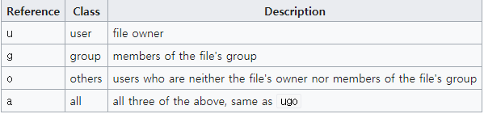
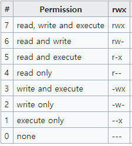

# Linux Command

> ###### 자세한 메뉴얼을 보고싶을 때
>
> ```
> 명령어 --help 
> ```
>
> ###### 더 자세한 명령어
>
> ```
> man 명령어 --help
> ```


---


### *command basic*


##### 현 경로상에 파일 목록을 출력

- a : 모든 파일(숨김파일까지) 출력 
- l : list 형태 (세로로 출력)

> ls (-al)


##### 경로 확인

> pwd


##### 경로 만들기

> mkdir 경로(폴더)


##### 파일 만들기

> touch 파일명


##### 터미널 흔적 지우기

> clear


###### 삭제

> rm 파일
>
> rm -r 경로


###### nano 에디터 열기

> nano [파일명]


###### 파일 읽기 or 사용자의 입력값 받기

> cat [파일명]
>
> cat [텍스트]  -> 텍스트 그대로 출력


###### 패키지 매니저 (download)

> ###### // apt의 버전을 최신상태로 만듦
>
> sudo apt -get update 
>
> ###### // 패키지 설치
>
> sudo apt-get install [ex.htop]
>
> ###### // 패키지 삭제
>
> sudo apt-get remove htop
>
> ###### // 패키지 검색
>
> sudo apt-cache search [keyword]


###### 다운로드 방법  

>  wget [경로.https://www.google.com/images/branding/googlelogo/1x/googlelogo_color_272x92dp.png]


---


### *IO Redirection*


###### command output

> //예시
>
> ls -l **>** result.txt 
>
> <u>*mean : 명령어의 결과를 result.txt에 담음*</u>

* `>` 덮어쓰기,  `>>` 이어쓰기


###### command input 

> cat **<** result.txt
>
> <u>*mean : result.txt의 데이터를 가져와 출력*</u> 


---


### *shell script*


`shell` : 사용자. 껍데기

`kernal` : 운영체제 중심. 핵심 


###### 현재 쉘 카테고리에서 어떤 프로그램을 쓰고 있는지 확인

> echo $0
>
> 출력 : bash


###### bash vs zsh

shell 스타일의 차이

평소 쓰는 script가 `bash`


###### shell script 

shell 명령어들의 실행 순서와 방법을 적어둔 파일

```
#!/bin/bash								// bash 명령어 해석기 사용
if ![ -d bak ]; then 					// if bak이란 direction이 없다면
	mkdir bak							// bak 경로를 만들어라
fi										// if문 종료
cp *.log bak							// log 확장자를 가진 모든 파일을 bak에 복붙
```


>###### yaans@ubuntu:~/study/command/script$ ./backup
>
>bash: ./backup: Permission denied **(실행 권한 실패)**
>
>###### yaans@ubuntu:~/study/command/script$ chmod +x backup
>
>**(실행을 위해 입력)**
>
>###### yaans@ubuntu:~/study/command/script$ ./backup


---


### *directory and file*


#### 1. directory

각각의 디렉토리마다 어떤 특징이 있는지 확인

> ##### yaans@ubuntu:/          		(최상위 디렉토리)

```
yaans@ubuntu:~$ pwd
/home/yaans
yaans@ubuntu:~$ cd /		> 최상위 디렉토리로 이동
yaans@ubuntu:/$ ls			> 디렉토리 확인
bin   cdrom  etc   lib    lib64   lost+found  mnt  proc  run   snap  swapfile  tmp  var
boot  dev    home  lib32  libx32  media		opt  root  sbin  srv   sys   usr

```


- **/bin** : 사용자들이 실행가능한 명령어들이 위치

- **/sbin** : 시스템 관리자(root 관리자)가 사용하는 명령어 위치 (ex.컴퓨터를 끄거나 재부팅하는 명령)

- **/etc** : 프로그램의 동작방법 설정을 담아두는 위치

- **/dev**

- **/proc**

- **/var** : 시스템에 사용되는 가변적인 파일들 저장 (ex. log)

- **/tmp** : 임시 데이터를 저장하는 위치 

- **/home** : 현재 사용자의 홈 디렉토리

  - ```
    cd ~ 		> 현재 사용자의 홈 디렉토리로 바로가기
    ```

- **/boot**
- **/lib** 
- **/opt** 
- **/mnt**
- **/media**
- **/srv**
- **/usr** : 대부분의 프로그램이 설치되어있는 위치


#### 2. file

> ###### locate *.log
>
> <u>*mean : log확장자를 가진 모든 파일의 위치를 **디비**에서 가져와 출력*</u>

\* **sudo apt install mlocate**


>###### find ./ -name google\*.\*
>
><u>*mean : 현 디랙토리 하위로 이름에 google을 포함한 파일 위치를 실시간으로 검색해 출력*</u>


> ###### whereis ls
>
> **$PATH** , **$MANPATH** 에서 실행파일의 위치를 찾아 반환

​	\* **$PATH** : 환경 변수


 

#### awk
- 파일이나 레코드(조회 결과처럼 공백으로 구분되어져 있는 각 줄)에 포함된 값을 조작하거나 데이터화
- 공백 기준 각 단어들을 필드로 칭하고 $1,,,$N으로 순서를 구분할 수 있다
- $0는 레코드(모든 필드를 포함한 한 행) 그 자체
- 응용
  - 특정 필드만 출력
  - 특정 필드에 문자열 추가
  - 패턴이 포함된 레코트 출력
  - 특정 필드에 연산 수행 등 

#### xargs 
- 파이프 이전에 명령을 인자로 받아 명령어를 실행
- 응용 
  - 앞에 출력한 조회 목록들을 kubectl delete pod 명령어의 인자로 만들어 수행
  - 조회한 txt 파일을 모두 읽어와 하나의 파일로 병합, 복사, 다운 등 활용 가능

---


### *process*


###### process list를 출력

> ps 
>
> ps aux 			(background의 프로세스까지)
>
> ps aux | grep apache 			(apache 텍스트를 포함한 프로세스 출력)


###### 사용하고 있는 프로그램을 끄지않고 다른 작업으로 전환

>  `ctrl` + `Z`

###### 다시 그 작업으로 돌아오기

> fg [%n번째]

###### 백그라운드로 돌려진 프로그램들 확인

> job

###### 실행과 동시에 백그라운드로 보내기 (오래걸리는 작업)

> 실행할 명령어 **&**


#### daemon

 항상 켜져있는 프로그램

> ###### cd /etc/init.d/
>
> 데몬 프로그램들이 모여있는 경로


###### 아파치2(데몬 프로그램) 서비스 시작

> sudo service apache2 start


###### apache2를 포함한 실행중인 프로세스 확인

> ps aux | grep apache2


###### 아파치2(데몬 프로그램) 서비스 종료

> sudo service apache2 stop


daemon 은 start, stop 명령어로 켜고 끌 수 있다


#### cron

정기적으로 명령어를 수행하는 방법

###### crontab 실행 후 수정

> crontab -e  		// 최초로 키는 경우 에디터 선택 후 실행된다


###### \* crontab에 테스트 코드 추가	> 1분마다 출력문 추가

```
*/1 * * * * date >> date.log
```


###### crontab 에 처리한 내용 출력

> crontab -l


###### 가장 뒤에 내용이 추가되면 출력

> tail -f date.log

###### crontab 실행 로그 확인
```
tail -f /var/log/syslog | grep CRON
```


---


### *user*


###### 현재 사용하고 있는 사용자가 누군지 확인

> id
>
> 출력 :
> uid=1000(yaans) gid=1000(yaans) . . .


###### 사용하고 있는 사용자들이 누구있는지 확인

> who
>
> 출력 :
> yaans    :0           2020-10-01 21:27 (:0) . . . 


###### 관리자와 일반 사용자

yaans@ubuntu:~**$**  : 일반사용자

yaans@ubuntu:~**#** : 관리자


###### 관리자로 변환

> su - root

<del>관리자 패스워드 바꾸며 unlock</del>

> sudo passwd -u root


---


### *permission*


#### 파일 권한

drwxr-xr-x

d | rwx | r-x | r-x

| d    | rwx         | r-x              | r-x              |
| ---- | ----------- | ---------------- | ---------------- |
| 타입 | 소유주 권한 | 그룹 사용자 권한 | 기타 사용자 권한 |

`r` : read 읽기 권한

`w` : write 쓰기 권한

`x` : execute 실행 권한

`-` : 권한 설정 없음


##### 권한 변경

> chmod o+w date.log
>
> <u>*mean : 모든 사용자(o)들의 쓰기 권한 추가*</u>

`+` : 권한 추가		`-`: 권한 제거


###### 실행이 특정 디렉토리에서만 제한한 실행파일의 경우고

> chmod u+x executefile.sh

###### 권한 설정으로 어디서든 특정 사용자가 접근할 수 있다

 

##### directory의 권한

> chmod o-r command-dir
>
> <u>*mean : directory의 다른사용자들의 읽기 권한을 제거해 접근 불가*</u>


##### chmod의 사용 응용법

- **사용자 클래스 구분**



- **숫자를 이용한 권한 부여**

  > chmod 777 abc.txt

  


---


### *group*

생략


---


### *internet & network & server*


1. ###### 현재 사용중인 컴퓨터 ip 주소 확인

   라우터로부터 private address를 확인

> ip addr


2. ###### 웹 html 소스를 출력 -> 현 컴퓨터 아이피를 알려주는 페이지 방문

   외부에 접속할 때 사용하는 ip. 즉 공인 ip(라우터 주소)를 확인

> curl ipinfo.io/ip


#### apache web server

> sudo apt-get update
>
> sudo apt-get install apache2
>
> 
>
> // 서비스 동작 테스트
>
> sudo service apache2 start [end || stop || restart]
>
> 
>
> // 웹브라우저 프로그램 설치
>
> sudo apt-get install elinks
>
> elinks 			> 리눅스용 web browser 출력  || q 로 종료


###### 내 아이피를 이용한 웹 브라우저 접속

> elinks [내 컴퓨터 ip]
>
> or
>
> elinks 127.0.0.1


###### index.html 변경

> cd /var/www/html 											> 이동
>
> sudo mv index.html test.html						 > 기본 가지고있는 index.html을 test.html로 변경
>
> 
>
> sudo nano index.html										>  테스트 html 파일 생성
>
> elinks 127.0.0.1													> 변경된 index.html 페이지 확인


###### 웹서버 로그 확인

> ###### [ 확인용 터미널 ]
>
> cd /var/log/apache2
>
> tail -f access.log

> ###### [ 접속용 터미널 ]
>
> elinks 127.0.0.1

\* *웹브라우저에 접속하면 실시간으로 access.log에 접속 기록이 저장된다*


#### SSH

> sudo apt-get install openssh-server [openssh-client]
>
> sudo service ssh start
>
> sudo ps aux | grep ssh 												> 동작 확인


###### 원격제어 할 컴퓨터에 접속

> sudo ssh 사용자이름@ip주소


#### port

<del>default gateway (공인 ip) 확인</del> 

> ip route


---


### *domain*


###### localhost 같은 호스트 이름을 설정할 수 있다

> nano etc/hosts					> ip와 host name 설정

\* 이 파일에 없으면 그때 DNS에서 검색


###### 사용하고 있는 DNS 서버의 ip 확인

> cat /etc/resolv.conf


###### 도메인으로 어떻게 연결되는지 확인

> dig +trace www.naver.com

1. 클라이언트 컴퓨터에 연결된 DNS 서버로 연결
2. root DNS 서버로 연결 (무조건 알고 있다)
3. com/co.kr/net 등 각각 도메인을 연결한 root DNS서버 중 필요한 root DNS 서버 연결
4. 요청한 DNS 서버의 ip를 요구
5. ip를 이용해 클라이언트는 브라우저에 연결


---


### *rsync*

remote로 서버간의 동기화


> //테스트를 진행하기 위한 경로 2개 생성
>
> mkdir from
>
> mkdir to
>
> 
>
> // from 경로로 이동
>
> cd from
>
> 
>
> // test파일 10개 생성
>
> touch test{1..10}
>
> 
>
> cd ..
>
> // from 경로 <u>안의</u> 파일들을 to 경로로 싱크
>
> rsync -a from/ to
>
> // 상세한 변경사항 확인 가능
>
> rsync -a**v** from/ to
>
> 출력
>
> ```
> sending incremental file list
> ./
> test5
> test6
> 
> sent 266 bytes  received 57 bytes  646.00 bytes/sec
> total size is 0  speedup is 0.00
> ```


---


### *ssh public key private key*


###### 다른 컴퓨터에 로그인

> ssh 다른사용자@다른사용자ip

*<u>-> 더 안전하게 로그인 해보자</u>*


###### ssh 공개키 비공개키 만들기

> ssh-keygen
>
> // test를 위해 비밀문구 없이 생성

###### 생성 확인

> cd ~
>
> cd .ssh
>
> ls -al 					> id_rsa (private key), id_rsa.pub (public key) 생성 확인

\* 공개키가 저장되어 있는 컴퓨터에 비밀키를 가지고 로그인이 가능하다


id_rsa.pub를 로그인할 컴퓨터의 authorized_keys 에 붙여넣는다

>  ssh-copy-id  다른사용자@다른사용자ip


---

#### 참고 자료

- ##### [생활코딩 - 리눅스](https://www.inflearn.com/course/%EC%83%9D%ED%99%9C%EC%BD%94%EB%94%A9-%EB%A6%AC%EB%88%85%EC%8A%A4-%EA%B0%95%EC%A2%8C/dashboard)
