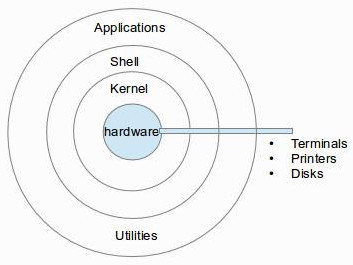

# Linux Command

> ###### 자세한 메뉴얼을 보고싶을 때
>
> ```
> 명령어 --help 
> ```
>
> ###### 더 자세한 명령어
>
> ```
> man 명령어 --help
> ```


---


### *command basic*


##### 현 경로상에 파일 목록을 출력

- a : 모든 파일(숨김파일까지) 출력 
- l : list 형태 (세로로 출력)

> ls (-al)


##### 경로 확인

> pwd


##### 경로 만들기

> mkdir 경로(폴더)


##### 파일 만들기

> touch 파일명


##### 터미널 흔적 지우기

> clear


###### 삭제

> rm 파일
>
> rm -r 경로


###### nano 에디터 열기

> nano [파일명]


###### 파일 읽기 or 사용자의 입력값 받기

> cat [파일명]
>
> cat [텍스트]  -> 텍스트 그대로 출력


###### 패키지 매니저 (download)

> ###### // apt의 버전을 최신상태로 만듦
>
> sudo apt -get update 
>
> ###### // 패키지 설치
>
> sudo apt-get install [ex.htop]
>
> ###### // 패키지 삭제
>
> sudo apt-get remove htop
>
> ###### // 패키지 검색
>
> sudo apt-cache search [keyword]


###### 다운로드 방법  

>  wget [경로.https://www.google.com/images/branding/googlelogo/1x/googlelogo_color_272x92dp.png]


---


### *IO Redirection*


###### command output

> //예시
>
> ls -l **>** result.txt 
>
> <u>*mean : 명령어의 결과를 result.txt에 담음*</u>

* `>` 덮어쓰기,  `>>` 이어쓰기


###### command input 

> cat **<** result.txt
>
> <u>*mean : result.txt의 데이터를 가져와 출력*</u> 


---


### *shell script*



`shell` : 사용자. 껍데기

`kernal` : 운영체제 중심. 핵심 


###### 현재 쉘 카테고리에서 어떤 프로그램을 쓰고 있는지 확인

> echo $0
>
> 출력 : bash


###### bash vs zsh

shell 스타일의 차이

평소 쓰는 script가 `bash`


###### shell script 

shell 명령어들의 실행 순서와 방법을 적어둔 파일

```
#!/bin/bash								// bash 명령어 해석기 사용
if ![ -d bak ]; then 					// if bak이란 direction이 없다면
	mkdir bak							// bak 경로를 만들어라
fi										// if문 종료
cp *.log bak							// log 확장자를 가진 모든 파일을 bak에 복붙
```


>###### yaans@ubuntu:~/study/command/script$ ./backup
>
>bash: ./backup: Permission denied **(실행 권한 실패)**
>
>###### yaans@ubuntu:~/study/command/script$ chmod +x backup
>
>**(실행을 위해 입력)**
>
>###### yaans@ubuntu:~/study/command/script$ ./backup


---


### *directory and file*


#### 1. directory

각각의 디렉토리마다 어떤 특징이 있는지 확인

> ##### yaans@ubuntu:/          		(최상위 디렉토리)

```
yaans@ubuntu:~$ pwd
/home/yaans
yaans@ubuntu:~$ cd /		> 최상위 디렉토리로 이동
yaans@ubuntu:/$ ls			> 디렉토리 확인
bin   cdrom  etc   lib    lib64   lost+found  mnt  proc  run   snap  swapfile  tmp  var
boot  dev    home  lib32  libx32  media		opt  root  sbin  srv   sys   usr

```


- **/bin** : 사용자들이 실행가능한 명령어들이 위치

- **/sbin** : 시스템 관리자(root 관리자)가 사용하는 명령어 위치 (ex.컴퓨터를 끄거나 재부팅하는 명령)

- **/etc** : 프로그램의 동작방법 설정을 담아두는 위치

- **/dev**

- **/proc**

- **/var** : 시스템에 사용되는 가변적인 파일들 저장 (ex. log)

- **/tmp** : 임시 데이터를 저장하는 위치 

- **/home** : 현재 사용자의 홈 디렉토리

  - ```
    cd ~ 		> 현재 사용자의 홈 디렉토리로 바로가기
    ```

- **/boot**
- **/lib** 
- **/opt** 
- **/mnt**
- **/media**
- **/srv**
- **/usr** : 대부분의 프로그램이 설치되어있는 위치


#### 2. file

> ###### locate *.log
>
> <u>*mean : log확장자를 가진 모든 파일의 위치를 **디비**에서 가져와 출력*</u>

\* **sudo apt install mlocate**


>###### find ./ -name google\*.\*
>
><u>*mean : 현 디랙토리 하위로 이름에 google을 포함한 파일 위치를 실시간으로 검색해 출력*</u>


> ###### whereis ls
>
> **$PATH** , **$MANPATH** 에서 실행파일의 위치를 찾아 반환

​	\* **$PATH** : 환경 변수


---


### *process*


###### process list를 출력

> ps 
>
> ps aux 			(background의 프로세스까지)
>
> ps aux | grep apache 			(apache 텍스트를 포함한 프로세스 출력)


###### 사용하고 있는 프로그램을 끄지않고 다른 작업으로 전환

>  `ctrl` + `Z`

###### 다시 그 작업으로 돌아오기

> fg [%n번째]

###### 백그라운드로 돌려진 프로그램들 확인

> job

###### 실행과 동시에 백그라운드로 보내기 (오래걸리는 작업)

> 실행할 명령어 **&**


#### daemon

 항상 켜져있는 프로그램

> ###### cd /etc/init.d/
>
> 데몬 프로그램들이 모여있는 경로


###### 아파치2(데몬 프로그램) 서비스 시작

> sudo service apache2 start


###### apache2를 포함한 실행중인 프로세스 확인

> ps aux | grep apache2


###### 아파치2(데몬 프로그램) 서비스 종료

> sudo service apache2 stop


daemon 은 start, stop 명령어로 켜고 끌 수 있다


#### cron

정기적으로 명령어를 수행하는 방법

###### crontab 실행 후 수정

> crontab -e  		// 최초로 키는 경우 에디터 선택 후 실행된다


###### \* crontab에 테스트 코드 추가	> 1분마다 출력문 추가

```
*/1 * * * * date >> date.log
```


###### crontab 에 처리한 내용 출력

> crontab -l


###### 가장 뒤에 내용이 추가되면 출력

> tail -f date.log


---

#### 참고 자료

- ##### [생활코딩 - 리눅스](https://www.inflearn.com/course/%EC%83%9D%ED%99%9C%EC%BD%94%EB%94%A9-%EB%A6%AC%EB%88%85%EC%8A%A4-%EA%B0%95%EC%A2%8C/dashboard)
