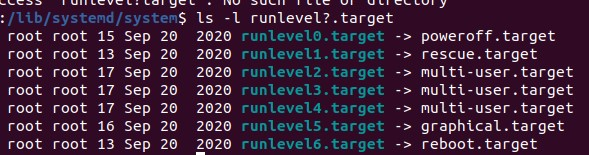

# 이것이 우분투 리눅스다

<br>


## Chapter 01 실습 환경 구축

- 가상머신 소프트웨어 : 컴퓨터에 설치된 운영체제(호스트 OS) 안에 가상의 컴퓨터를 만들고 그 가상의 컴퓨터 안에 또 다른 운영제체(게스트 OS)를 설치/운영할 수 있도록 제작된 소프트웨어
  - 호스트 운영체제 : 기존 PC에 설치되어 있는 운영체제
  - 게스트 운영체제 : 가상머신에 설치한 운영체제 

<br>


> 호스트 컴퓨터가 게스트 컴퓨터에게 메모리를 나눠주는 때
>
> - 가상 머신을 만든 시점이 아닌 가상머신을 **부팅**하는 시점
> - 가상머신을 끄면(shutdown) 게스트 컴퓨터에게 나눠줬던 메모라는 다시 호스트 컴퓨터로 돌아온다

<br>


## Chapter 02 우분투 리눅스 소개

<br>

##### 커널

##### 우분투 리눅스

<br>


## Chapter 03 우분투 리눅스 설치

<br>


## Chapter 04 서버를 구축할 때 알아야 할 필수 개념과 명령어

<br>

#### 주의 사항

- 리눅스/유닉스 : 대소문자 구분
- sudo 명령어 : 일반 사용자가 관리자 권한으로 명령어를 실행
- root 사용자와 일반 사용자를 구분하는 프롬프트 표식
  - root 사용자 : `#`
  - 일반 사용자 : `$`

<br>


#### 가상 콘솔

- 우분투는 총 7개의 가상 콘솔을 제공한다
  - 컴퓨터 한 대에 모니터 일곱 개가 연결된 효과
- Server를 부팅하면 X 윈도가 자동으로 실행되고 7개의 가상 콘솔 중에서 7번째라고 생각하면 된다
- 나머지 1~6번 가상 콘솔은 텍스트 모드로 제공된다
- **단축키** : `Ctrl` + `Alt` + `F*` 

<br>


#### 런레벨

- 시스템이 가동되는 방법 7가지

  | 런레벨 | 영문 모드  | 설명                           | 비고             |
  | ------ | ---------- | ------------------------------ | ---------------- |
  | 0      | Power Off  | 종료 모드                      |                  |
  | 1      | Rescue     | 시스템 복구 모드               | 단일 사용자 모드 |
  | 2      | Multi-User |                                | 사용하지 않음    |
  | 3      | Multi-User | 텍스트 모드의 다중 사용자 모드 |                  |
  | 4      | Multi-User |                                | 사용하지 않음    |
  | 5      | Graphical  | 그래픽 모드의 다중 사용자 모드 |                  |
  | 6      | Reboot     |                                |                  |

  \* 2, 4번은 우분투에서는 사용하지 않지만 호환성을 위해서 런레벨 3번과 동일한 것으로 취급한다

- `/lib/systemd/system` 디렉터리의 `runlevel?.target` 파일에서 런레벨 모드 확인 가능
  
  - 각 파일은 링크 파일이고, 실제 파일과 연결되어 있다 (바로가기 아이콘과 비슷한 개념)

- 시스템에 기본으로 설정된 런레벨 확인하기

  ```shell
  ****@ubuntu:/lib/systemd/system$ ls -l /lib/systemd/system/default.target
  lrwxrwxrwx 1 root root 16 Sep 20  2020 /lib/systemd/system/default.target -> graphical.target
  ```

  - 이 시스템은 처음 부팅할 때 그래픽 환경으로 부팅되도록 설정되어 있다	

<br>


#### 에디터 사용

| 키   | 설명                                   | 키   | 설명                              |
| ---- | -------------------------------------- | ---- | --------------------------------- |
| i    | 현재 커서의 위치부터 입력              | I    | 현재 커서 줄의 맨 앞부터 입력     |
| a    | 현재 커서의 위치 다음 칸부터 입력      | A    | 현재 커서 줄의 맨 마지막부터 입력 |
| o    | 현재 커서의 다음 줄에 입력             | O    | 현재 커서의 이전 줄에 입력        |
| s    | 현재 커서 위치의 한 글자를 지우고 입력 | S    | 현재 커서의 한 줄을 지우고 입력.  |

<br>


#### 도움말 사용법

- `man <명령어>`
- 도움말에서 특정 단어를 검색하고 싶을 때 `/단어`를 실행
  - 다음 단어로 넘기기 위해 `N` 사용

<br>


#### 마운트와 CD/DVD/USB의 활용

- **마운트** : 물리적인 장치를 특정한 위치(대개는 폴더)에 연결시켜 주는 과정


<br>


### 기본 명령어

- cd
- pwd
- rm
- cp
- touch
- mv
  - `mv 파일명 디렉터리`
- mkdir
- rmdir
  - 파일 들어있는 디렉터리 삭제 `rmdir -r 디렉터리`
- cat
  - 파일 내용 화면에 출력. 여러 개 파일을 나열하면 파일을 연결해서 보여준다
- head, tail
  - 텍스트 형식으로 작성된 파일의 앞 10행 또는 마지막 10행만 화면에 출력
  - `head -3 파일명` : 앞 3줄만 출력
-  more
  - 텍스트 형식 파일을 페이지 단위로 화면에 출력
- less
  - more의 기능보다 확장
- file
  - 해당 파일이 어떤 종류의 파일인지 표시
- clear
  - 현재 사용 중인 터미널 화면을 깨끗하게 지워준다

<br>


### 사용자 관리와 파일 속성

<br>


#### 사용자와 그룹

리눅스는 다중 사용자 시스템(multi-user system)

1대의 리눅스에 사용자 여러 명이 동시에 접속해서 사용할 수 있는 시스템

**root** : 시스템의 모든 작업을 실행할 수 있는 권한을 가진 사용자. 시스템 접속할 사용자 생성 권한 가짐 

#### 
