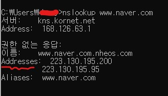
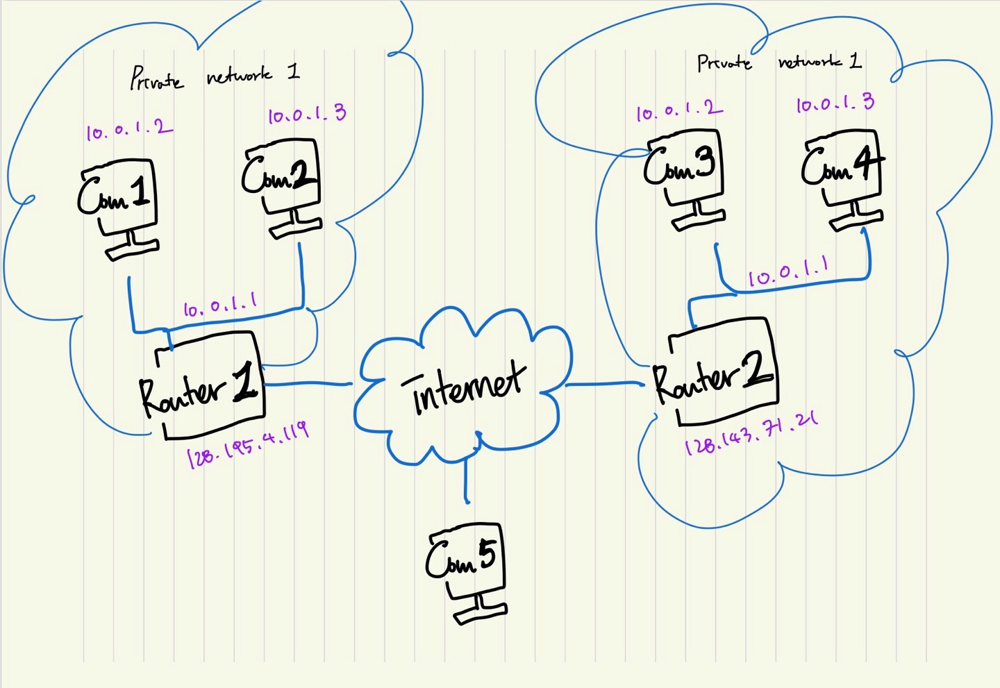

# IP

<br>


### IP : Internet Protocol

- 인터넷에서 다른 컴퓨터와 통신할 때 사용하는 프로토콜
- 컴퓨터의 논리적인 주소를 구분
- 1bit -> 1/0으로 표현
- 32bit 체계를 사용해서 40억 개의 주소 표현 가능

<br>


##### nslookup 명령어를 통해 웹서버의 ip 주소 확인



<br>


### IPv4

- 일반적인 의미의 IP
- IPv4의 문제점 : 오직 32비트만을 사용해서 공인 주소 40억개로는 현재 전 세계 컴퓨터를 수용하기에는 부족
- 해결안으로 새로운 주소 체계 IPv6 등장

<br>


### IP의 분류

- 공인 IP

  - 세계에서 단 하나만 존재하는 IP 주소

- 사설 IP

  - 공유기를 이용해 만들 수 있는 가상의 IP 주소, 공유기로 연결된 내부망에 적용되는 IP 주소

    

    ##### 왼쪽 네트워크에 있는 Com 1 `10.0.1.2`가 오른쪽 네트워크의 Com 3 `10.0.1.2`와 소통하는 방법

    - Router 1 `128.195.4.119`를 거쳐서 인터넷에 접근
    - 수많은 라우터&내부망을 거치고 Router 2 `128.143.71.21`에 도착
    - Router 2 내부의 Com 3 `10.0.1.2`에 도달!

  - 고정 IP

    - 해당 컴퓨터의 IP 주소를 고정적으로 사용

  - 유동 IP

    - 수시로 변화하는 IP 주소

<br>


#### 사설 IP 종류

cmd로 내 IP 확인

```shell
> ipconfig
```

- A 클래스 사설 IP 대역
  - 10.0.0.0 ~ 10.255.255.255
- B 클래스 사설 IP 대역
  - 172.16.0.0 ~ 172.31.255.255
- C 클래스 사설 IP 대역
  - 192.168.0.0 ~ 192.168.255.255

<br>


#### 사설 IP의 단점? -> 특징

- 외부에서 내 컴퓨터를 찾을 수 없다
- 내부에서만 의미가 있고 외부에서는 해당 IP로 접속이 불가능 하기 때문

<br>


### NAT : Network Address Translation

- 공유기가 하나의 공인 IP를 내부 사설 IP로 나누는 기술
- 사설 IP 사용으로 내부망을 보호하는 역할
- 각각 연결된 PC 관리가 수월


